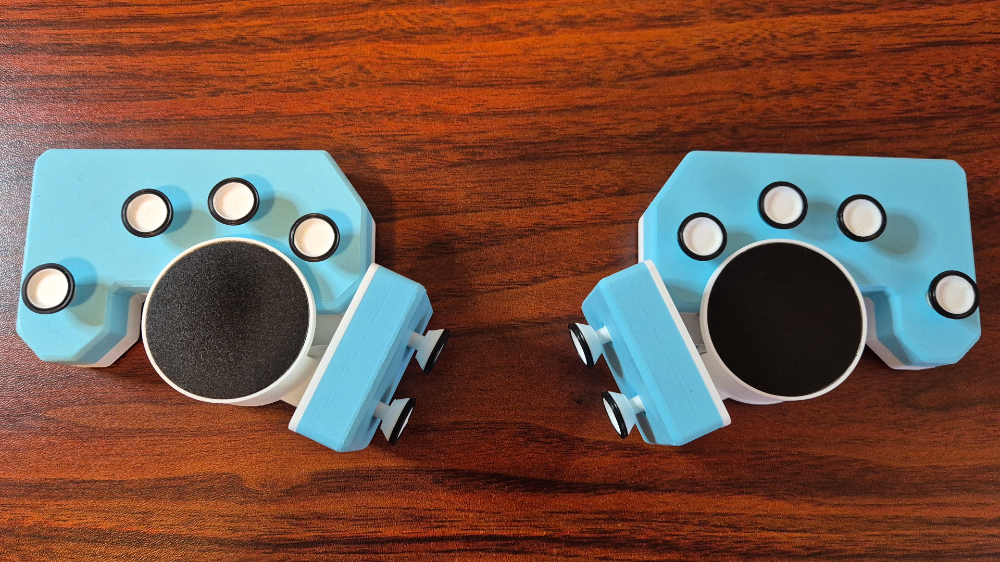
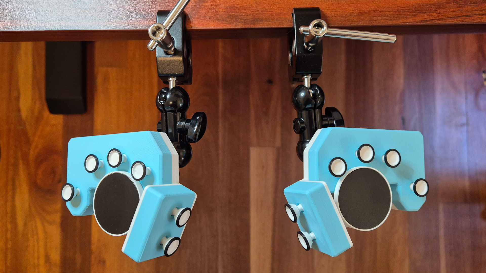
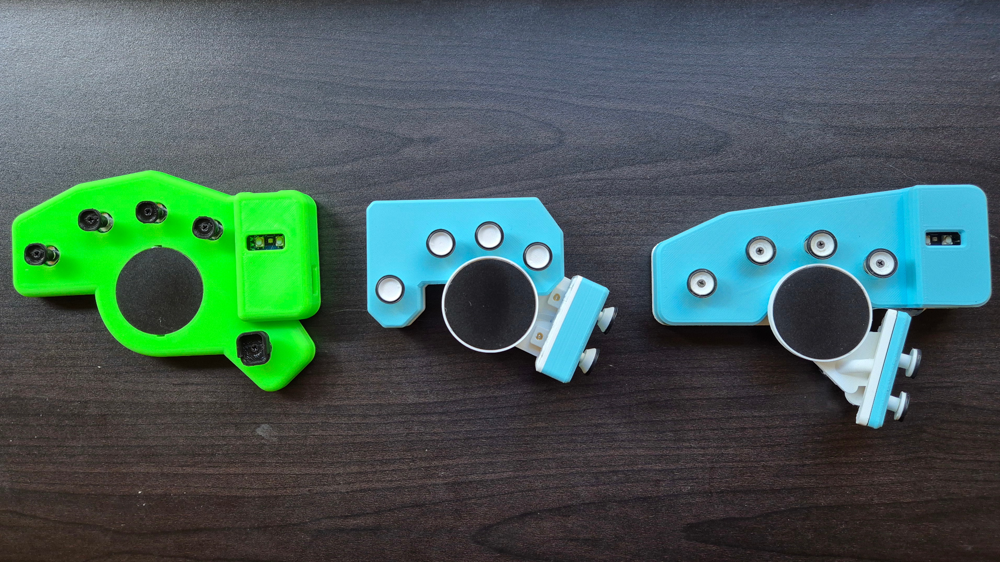

# Harite v3.0 Directional Keyboard

- 4-way joystick cluster using mouse switches with a 35-40g actuation force
- 48 total switches
- Bluetooth wireless or USB-C wired
- ZMK studio support for live keymap changes
- Dual trackpads for pointing and scrolling
- Can also support trackballs and analog sticks
- Fully open source and built with open source tools

To make your own, here is a detailed [build guide](./build.md)

## Images

Tented using the built-in camera mount nut and a SmallRig clamp

Family Photo

## Videos

- [Jun 5, 2025 - Harite v3 Work in Progress Update](https://youtu.be/gxmuGMYN8iI?si=tEg1mbLF8ET155gk)
- [Jul 20, 2025 - Introducing Harite v3](https://youtu.be/IIlZKIpx4Kw)

## Attributions

Some design elements were inspired by the [CharaChorder CAD Repository](https://github.com/CharaChorder/CAD-CAM)
