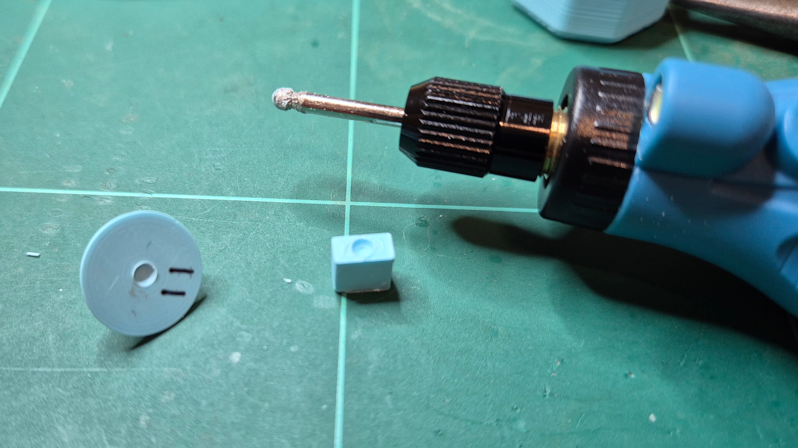

# Build

## PCB

Due to licensing differences the PCB is in the [harite-v3-pcb](https://github.com/dlip/harite-v3-pcb) repo

## Joysticks

### Joysticks Components

| Name                                                 | Qty                                             | Link                                                    |
| ---------------------------------------------------- | ----------------------------------------------- | ------------------------------------------------------- |
| X-Ring of thickness 1.78mm and inner diameter 6.75mm | 12 min (but get 30+ since they break sometimes) | <https://www.aliexpress.com/item/1005006039394059.html> |
| Ball Bearing 2mm (steel, ceramic etc.)               | 12                                              | <https://www.aliexpress.com/item/1005008116669372.html> |
| Super Glue                                           | 1                                               |                                                         |

### Joysticks 3D Printed Parts

Due to 3D printing not being perfectly accurate, I have provided various heights for the stem base. I have found 1.4 mm to work most of the time, so start with that and go up if it feels loose or go down if it feels stiff and crunchy.

| Name            | Qty            | Layer Height | Infill | Supports | Link                                                                              |
| --------------- | -------------- | ------------ | ------ | -------- | --------------------------------------------------------------------------------- |
| Pivot Base      | 12             | 0.1mm        | 10%    | No       | [Step](./freecad/caps-pivot-bearing.step) [Stl](./freecad/caps-pivot-bearing.stl) |
| Cap             | 12             | 0.1mm        | 10%    | No       | [Step](./freecad/caps-stickcap.step) [Stl](./freecad/caps-stickcap.stl)           |
| Stem 1.1mm Base | 12 total stems | 0.1mm        | 10%    | No       | [Step](./freecad/caps-stickstem11.step) [Stl](./freecad/caps-stickstem11.stl)     |
| Stem 1.2mm Base | 12 total stems | 0.1mm        | 10%    | No       | [Step](./freecad/caps-stickstem12.step) [Stl](./freecad/caps-stickstem12.stl)     |
| Stem 1.3mm Base | 12 total stems | 0.1mm        | 10%    | No       | [Step](./freecad/caps-stickstem13.step) [Stl](./freecad/caps-stickstem13.stl)     |
| Stem 1.4mm Base | 12 total stems | 0.1mm        | 10%    | No       | [Step](./freecad/caps-stickstem14.step) [Stl](./freecad/caps-stickstem14.stl)     |
| Stem 1.5mm Base | 12 total stems | 0.1mm        | 10%    | No       | [Step](./freecad/caps-stickstem15.step) [Stl](./freecad/caps-stickstem15.stl)     |
| Stem 1.6mm Base | 12 total stems | 0.1mm        | 10%    | No       | [Step](./freecad/caps-stickstem16.step) [Stl](./freecad/caps-stickstem16.stl)     |

### Joysticks Preparation

Since 3D printing is rough and inaccurate, especially with small, round parts some post processing is required.
I recommend a rotary tool with 2.3mm spherical tip like this [Hardell](https://www.amazon.com.au/gp/product/B0DFTJFYY8) one, or a Dremel.
An alternative is using a 2mm drill bit, but the result wont be as smooth.

- Widen the hole in the pivot base little by little, and sit the bearing in the crevice. The total height of the pivot base + bearing should be around 8.0mm, which you can measure with digital calipers. You can then super glue it in. I find using the blunt side of a toothpick a good tool to apply the glue with.
- Widen the hole in the stem little by little, until it sits flush on the 4 switches + stem. If there is any rocking back and forth, drill further. There should be a small deadzone when pressing down in the middle onto the bearing, if switches are triggered you've gone too far and should print a new stem.
  
- To fit the X-Rings use needle nose pliers to stretch them over the sides as shown, then use some blunt tweezers to pull then out to the front and back sides. Hold the ring down on top with the tweezers as you release the pliers and pull them out. Be careful the ring twist doesn't twist.
  

## Tester

This is handy if you just want to test out switches or tweak the design

### Tester 3D Printed Parts

| Name        | Qty | Layer Height | Infill | Supports | Link                                                                                              |
| ----------- | --- | ------------ | ------ | -------- | ------------------------------------------------------------------------------------------------- |
| Tester Base | 1   | 0.2mm        | 10%    | No       | [Step](./freecad/thumb-cluster-test-base.step) [Stl](./freecad/thumb-cluster-test-base.stl)       |
| Tester Top  | 1   | 0.1mm        | 10%    | No       | [Step](./freecad/caps-testertop-stick-print.step) [Stl](./freecad/caps-testertop-stick-print.stl) |

## Dual Cirque Configuration

### Dual Cirque Components

| Name                                                      | Qty | Link                                                           |
| --------------------------------------------------------- | --- | -------------------------------------------------------------- |
| Cirque 40mm Trackpads TM040040-2024-302 with flat overlay | 2   | <https://au.mouser.com/ProductDetail/Cirque/TM040040-2024-302> |
| 12 pin FFC cable type-A 0.5 pitch 6cm length              | 2   | <https://www.aliexpress.com/item/10000013182312.html>          |
| M2 Stainless Steel Countersunk Screw 10mm                 | 8   | <https://www.aliexpress.com/item/1005007257158892.html>        |
| M2 Stainless Steel Countersunk Screw 6mm                  | 16  | <https://www.aliexpress.com/item/1005007257158892.html>        |
| M2 knurled insert nuts 3mm length 3.5mm OD                | 24  | <https://www.aliexpress.com/item/1005008897571758.html>        |
| 1/4-20 8mm OD 6mm height Knurled Insert Nut               | 2   | <https://www.aliexpress.com/item/1005005225137961.html>        |
| Rubber Feet 1cm diameter                                  | 12  |                                                                |
| Blu Tak                                                   | 1   |                                                                |

### Dual Cirque 3D Printed Parts

| Name               | Qty | Layer Height | Infill | Supports | Link                                                                                                                                        |
| ------------------ | --- | ------------ | ------ | -------- | ------------------------------------------------------------------------------------------------------------------------------------------- |
| Mount Base Left    | 1   | 0.2mm        | 30%    | No       | [Step](./freecad/mount-base-mount-left.step) [Stl](./freecad/mount-base-mount-left.stl)                                                     |
| Mount Base Right   | 1   | 0.2mm        | 30%    | No       | [Step](./freecad/mount-base-mount-right.step) [Stl](./freecad/mount-base-mount-right.stl)                                                   |
| Top Left           | 1   | 0.1mm        | 10%    | No       | [Step](./freecad/left-casetop-stick-print.step) [Stl](./freecad/left-casetop-stick-print.stl)                                               |
| Top Right          | 1   | 0.1mm        | 10%    | No       | [Step](./freecad/left-casetop-stick-right-print.step) [Stl](./freecad/left-casetop-stick-right-print.stl)                                   |
| Thumb Cluster Base | 2   | 0.2mm        | 10%    | No       | [Step](./freecad/thumb-cluster-thumb-cluster-casebase-print.step) [Stl](./freecad/thumb-cluster-thumb-cluster-casebase-print.stl)           |
| Thumb Cluster Top  | 2   | 0.1mm        | 10%    | No       | [Step](./freecad/thumb-cluster-thumb-cluster-casetop-stick-print.step) [Stl](./freecad/thumb-cluster-thumb-cluster-casetop-stick-print.stl) |
| Cirque Mount Left  | 1   | 0.1mm        | 10%    | Yes      | [Step](./freecad/cirque-mount-left.step) [Stl](./freecad/cirque-mount-left.stl)                                                             |
| Cirque Mount Right | 1   | 0.1mm        | 10%    | Yes      | [Step](./freecad/cirque-mount-right.step) [Stl](./freecad/cirque-mount-right.stl)                                                           |

### Dual Cirque Assembly

- Melt M3 insert nuts into top of the cases, thumb cluster base and cirque mount. 180c is a good iron temperature.
  
- Melt 1/4-20 insert nut into back of the base. 300c is a good iron temperature. Be sure not to go too deep as it may offset the PCB, leave about 0.5mm sticking out.
- Add rubber feet to base.
  

- Push joystick stems onto caps through the holes in the top of the cases
- Connect FFC cables to the thumb cluster and Cirque. Use Blu Tak to help keep Cirque in place.
  

- Screw main top on using 10mm screws, then the thumb cluster base and cirque mount with 6mm screws
  
- Done!
  
